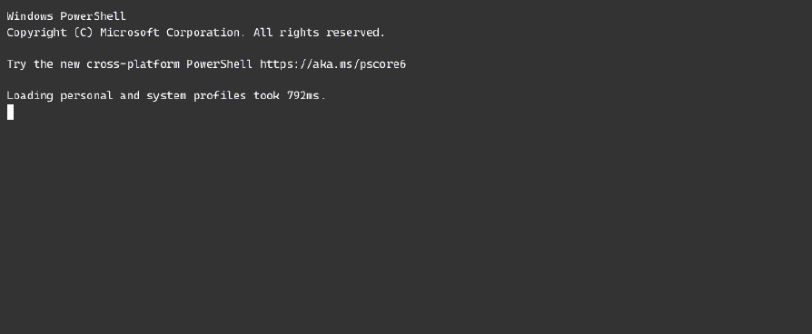
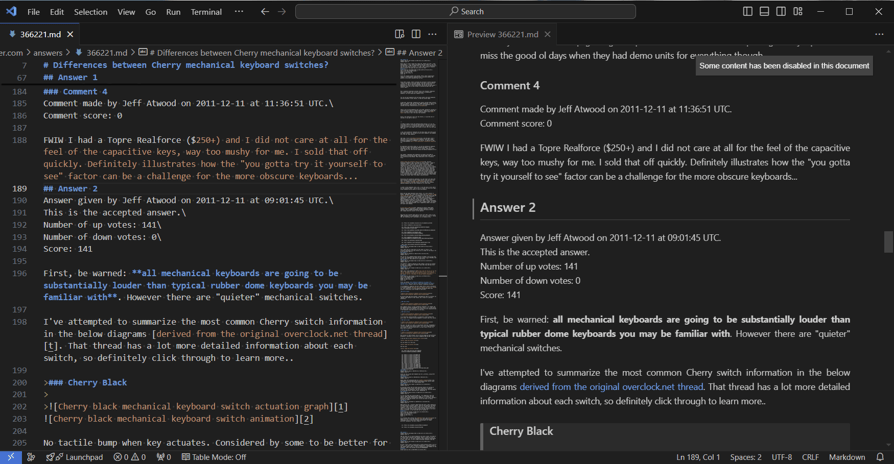
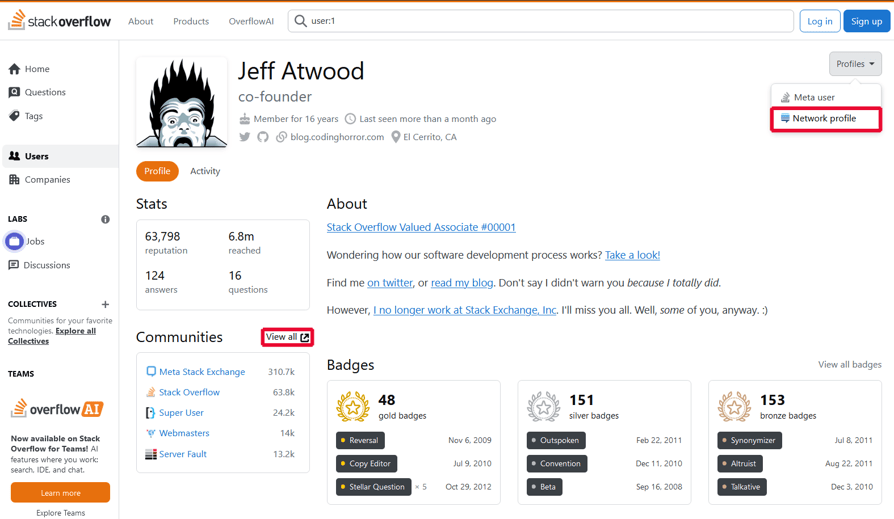
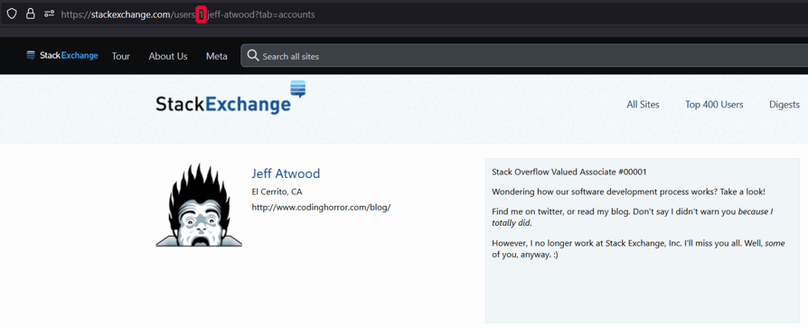

# Stack Exchange Backup

Download all your posts on the Stack Exchange network as Markdown files 
via a Python script talking to the [Stack Exchange API](https://api.stackexchange.com/).

## Showcase




## Installation

1. Either download the repository as a ZIP file and extract it, 
    or [install Git](https://git-scm.com/downloads) (recommended) and do a `git clone` of the project:

    ```shell
    git clone https://github.com/9ao9ai9ar/stack-exchange-backup.git
    ```

2. [Install Python 3.12+](https://www.python.org/downloads/).
    See the [support section](#support) for additional information.

3. Enter the directory you just extracted/cloned:

    ```shell
    cd stack-exchange-backup
    ```

    All steps hereafter assume operations under said directory.

4. Create and activate a virtual environment (strongly recommended).

    1. If you're on Windows and have kept the defaults when installing Python using the official installer, 
        the Python Launcher `py` should be installed alongside it, 
        and you can issue the following command in a command-line shell:
    
        ```shell
        py -3.12 -m venv .venv 
        ```
    
        Otherwise, check the Python version on your *PATH* with `python -V` and, 
        if it meets the minimum required Python version, 
        create a virtual environment by executing:
    
        ```shell
        python -m venv .venv
        ```
    
        On Linux, venv is usually in its own package separate from the Python installation, 
        in which case consult your distribution's documentation on how to install venv before proceeding.

    2. After a virtual environment has been created, you need to activate it.
        For Linux and macOS, the command is:
    
        ```shell 
        . .venv/bin/activate
        ```
    
        and for Windows it is:
    
        ```shell
        .\.venv\Scripts\activate
        ```
    
        Note that if you're using PowerShell on Windows, 
        you'd first have to enable script execution in order to activate the virtual environment:
    
        ```powershell
        Set-ExecutionPolicy -ExecutionPolicy AllSigned -Scope CurrentUser
        ```

5. Install `stack-exchange-backup` as a local Python package using pip:

    ```shell
    python -m pip install .
    ```
    
    You may have to [ensure pip is installed](https://pip.pypa.io/en/stable/installation/) because, 
    like venv, pip doesn't come bundled with Python in most Linux distributions.

In the future, I may consider publishing the program either as a package on PyPI or as a self-contained executable, 
so that the installation guide can be simpler than it already is.

## Usage

```console
$ python -m stackexchange.backup --help
usage: backup.py [-h] --account_id ACCOUNT_ID [--out_dir OUT_DIR] [--request_key REQUEST_KEY] [--rps RPS]

options:
  -h, --help            show this help message and exit
  --account_id ACCOUNT_ID
                        account id
  --out_dir OUT_DIR     output directory
  --request_key REQUEST_KEY
                        request key
  --rps RPS             requests per second limit
```

* `ACCOUNT_ID`: the ID of a Stack Exchange account.
Note that this is NOT the per-site user IDs you normally see on a user's profile page.
To acquire the `ACCOUNT_ID` of a user:

    1. Go to the user's profile page on one of the Stack Exchange network sites, 
        and click on either the *View all* link next to *Communities* 
        or the *Network profile* link in the dropdown under *Profiles*.
       
        

    2. On the new web page that is just opened, 
        note the URL segment after `users` consists of a number: 
        this is the `ACCOUNT_ID` of the user (1 in the case of Jeff Atwood).

        

* `OUT_DIR`: the root folder to download your files to, 
can be either a relative path or an absolute path.
Defaults to `q_and_a`.

* `REQUEST_KEY`: we provide a default request key only for your convenience.
As per this [FAQ](https://stackapps.com/q/67) on Stack Apps, 
it is advisable that users [bring their own request keys](https://stackapps.com/apps/oauth/register).
To access the API without a request key, you can give `""` as the value to this option.

* `RPS`: requests per second, defined as a soft limit in the current implementation of the program.
It is stated in the [docs](https://api.stackexchange.com/docs/throttle) in no uncertain terms that 
the Stack Exchange API considers 30+ requests per second per IP to be very abusive, 
and will thus ban the rogue IP from making further requests to the API for an indefinite period of time.
Due to the nature of floating-point arithmetic and the limitations of the current implementation, 
do not assume it is an exact upper bound on the number of requests the program will make within any one-second period.
In light of this, the default is a rather conservative 20 requests per second.

## Format

**NOTE**: The output directory structure, filenames as well as the Markdown content layout format, 
are all still subject to change without prior notice.
If the output format is modified, this README will be updated to reflect the changes.

The output directory has the following structure:

```console
+---<stack exchange site 1 hostname>
|   +---answers
|   |       <question id associated with answer 1 id>.md
|   |       <question id associated with answer 2 id>.md
|   |       ...
|   |
|   \---questions
|           <question 1 id>.md
|           <question 2 id>.md
|           ...
|
+---<stack exchange site 2 hostname>
|   +---answers
|   |       <question id associated with answer 1 id>.md
|   |       <question id associated with answer 2 id>.md
|   |       ...
|   |
|   \---questions
|           <question 1 id>.md
|           <question 2 id>.md
|           ...
|
...
```

Each Markdown file will represent either a question or an answer, 
depending on whether it is under a `questions` directory or an `answers` directory.
If the Markdown file represents a question, then the question creator will be you.
Otherwise, if the Markdown file represents an answer, the question creator will not be you, 
but the creator of one of the answers included in the Markdown file will be you.
More specifically, each Markdown file will have the following format 
(text that is inside angle brackets, such as `<this>`, represents text that will vary for each Markdown file):

```markdown
Question downloaded from <question link>
Question asked by <username for question creator> on <question date> at <question time>.
Number of up votes: <number of up votes for question>
Number of down votes: <number of down votes for question>
Score: <overall score associated with the question (number of up votes - number of down votes)>

# <question title>
<question body>

<loop through 1..i if there are comments for the question>

### Comment <i>
Comment made by <username for comment i creator> on <comment i date> at <comment i time>.
Comment score: <number of up votes for comment i>

<comment i body>

<loop through 1..j if there are answers for the question>

## Answer <j>
Answer given by <username for answer j creator> on <answer j date> at <answer j time>.
This <is/is not> the accepted answer.
Number of up votes: <number of up votes for answer j>
Number of down votes: <number of down votes for answer j>
Score: <overall score associated with answer j (number of up votes - number of down votes)>

<answer j body>

<loop through 1..k if there are comments for answer j>

### Comment <k>
Comment made by <username for comment k creator> on <comment k date> at <comment k time>.
Comment score: <number of up votes for comment k>

<comment k body>
```

## Alternatives

### [mhdadk/stack-exchange-backup](https://github.com/mhdadk/stack-exchange-backup)

The original repository from which this fork is derived.
I'd like to express my thanks to its author, Mahmoud Abdelkhalek, 
for his well-commented code expedited my process of grokking the Stack Exchange API, which, 
while conceptually simple, has its documentation of related topics and the numerous bugs scattered all over the place, 
and certain important terms left undefined.
His code also has fewer dependencies, reliant only on the popular `requests` package, 
and, due to using only the builtin data structures, uses around 30% less memory.
I only learnt of [Pydantic V2's high memory usage](https://github.com/pydantic/pydantic/issues/8652) 
after the rewrite is mostly complete.
If I had discovered the issue earlier, I might have gone with the less resource demanding 
and potentially more performant [msgspec](https://github.com/jcrist/msgspec), 
despite it being written mostly in Python rather than Rust and having fewer features.
Hopefully, Pydantic fixes their high memory consumption in a future release 
so that I only have to update to a newer version of the package instead of modifying the source code.

### [ryancwalsh/StackExchangeBackupLaravelPHP](https://github.com/ryancwalsh/StackExchangeBackupLaravelPHP)

StackExchangeBackupLaravel allows exporting a more complete data footprint of 
a user on the Stack Exchange network, but the outputs are in JSON rather than Markdown.

### [Stack Exchange Data Explorer](https://data.stackexchange.com/)

The Stack Exchange Data Explorer (SEDE) is an open source tool 
for running arbitrary queries against public data from the Stack Exchange network.
There are ready-made queries to back up your posts on the Stack Exchange network as a 
[single HTML file](https://data.stackexchange.com/meta.stackexchange/query/758326), or as a 
[CSV that includes both HTML and Markdown contents](https://data.stackexchange.com/meta.stackexchange/query/1811712).
Unfortunately, they are still more than one click away from outputting the Markdown as individual source files.
Moreover, to use the SEDE service, you'd either have to log in or solve some CAPTCHAs first, 
and [the data is only updated every Sunday morning around 3:00 UTC](https://data.stackexchange.com/help#faq), 
as opposed to the data returned by the API, 
[which is updated about once a minute](https://stackapps.com/a/4665).

### [Stack Exchange Data Dump](https://archive.org/details/stackexchange)

This is a quarterly dump of all user-contributed data on the Stack Exchange network.
In an [announcement](https://meta.stackexchange.com/q/401324) made in July 2024, 
the data dumps will no longer be uploaded to the Internet Archive; 
instead, they will be provided from a section of the site user profile on a Stack Exchange profile.
This is set to go into effect by mid-August, 2024.
Therefore, this method of backup has two major downsides:

1. Being locked behind a login wall.
2. Being complete, meaning that the download size is humongous, and to get only your data, 
    you'd have to do some non-trivial parsing of the downloaded XML files yourself.

## Development

In addition to the `dev` dependencies, this project relies on the following tools: 

* [uv](https://github.com/astral-sh/uv) (install standalone executable)
* [Pyright](https://github.com/microsoft/pyright) (`npm install pyright`)
* [security-constraints](https://github.com/mam-dev/security-constraints) (`uv tool install security-constraints`)
* [BumpVer](https://github.com/mbarkhau/bumpver) (`uv tool install bumpver`)

Everytime I want to checkpoint my code, I run the following commands in PowerShell:

```pwsh
#!/usr/bin/env pwsh

# Define and input your SC_GITHUB_TOKEN:
# $env:SC_GITHUB_TOKEN = "..."
$true | Out-Null `
&& uv self update `
&& security-constraints --min-severity low --output ./requirements/constraints.txt `
&& uv pip compile `
    --constraint ./requirements/constraints.txt `
    --output-file ./requirements/prod.txt `
    ./pyproject.toml `
&& uv pip compile `
    --extra dev `
    --constraint ./requirements/prod.txt `
    --constraint ./requirements/constraints.txt `
    --output-file ./requirements/dev.txt `
    ./pyproject.toml `
&& uv pip sync ./requirements/dev.txt `
&& uv pip install --editable . `
&& python -m openapi_spec_validator --errors all ./resources/openapi/openapi.yaml `
&& python -m datamodel_code_generator `
&& python -m ruff check `
&& python -m pylint ./src/ ./tests/ `
&& npm update pyright `
&& pyright `
&& python -m pytest -vvr A --no-summary ./tests/ `
&& bumpver update --patch --no-fetch
```

To help you in your experimentation with the Stack Exchange APIs through the documentation webpages, 
I have compiled a list of the parameter types and their associated icons as below:

* : Strings
* : 
[Numbers](https://api.stackexchange.com/docs/numbers)
* : 
[Dates](https://api.stackexchange.com/docs/dates)
* : 
[Lists](https://api.stackexchange.com/docs/vectors)
* : 
[Keys](https://api.stackexchange.com/docs/authentication)
* : 
[Access Tokens](https://api.stackexchange.com/docs/authentication)

Except for numbers and dates, the icons are not explained anywhere in the documentation, 
but if you open up the inspector in your web browser, 
say when you're on [this page](https://api.stackexchange.com/docs/edit-question), and check the `input` nodes, 
you'll see that the `class` attributes include `string-type`, `number-type`, etc., 
which give you enough hint of how they should be inputted.

## Support

It is my policy to strive to support all 
[non-end-of-life stable releases](https://devguide.python.org/versions/#status-key) of Python.
However, indispensable features I rely on are sometimes not supported on older Python versions without backporting.
Therefore, I can only promise my code will run on the latest bugfix release of Python.
If you are a Windows user and wants to use an older, supported Python release, 
do note that the official website does not provide binaries for the security releases, 
so I encourage you to instead install it through one of the following conda distributions or package managers 
to benefit from the continuing security fixes:

* [Miniconda](https://docs.anaconda.com/miniconda/)
* [Miniforge](https://github.com/conda-forge/miniforge)
* [Micromamba](https://mamba.readthedocs.io/en/latest/installation/micromamba-installation.html)
* [Pixi](https://pixi.sh/latest/)
