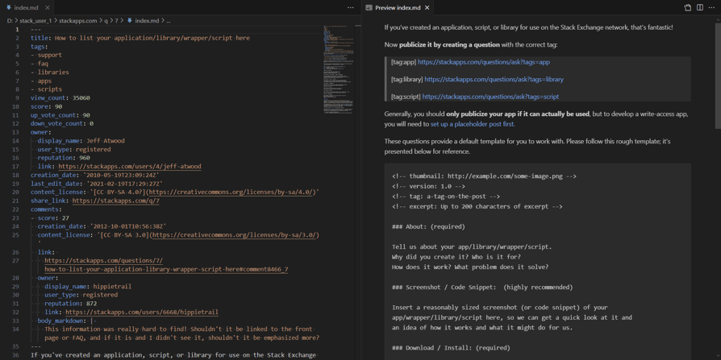
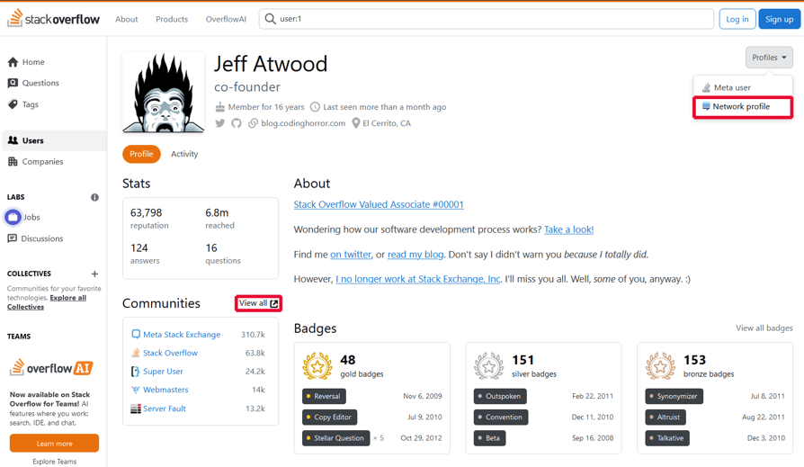
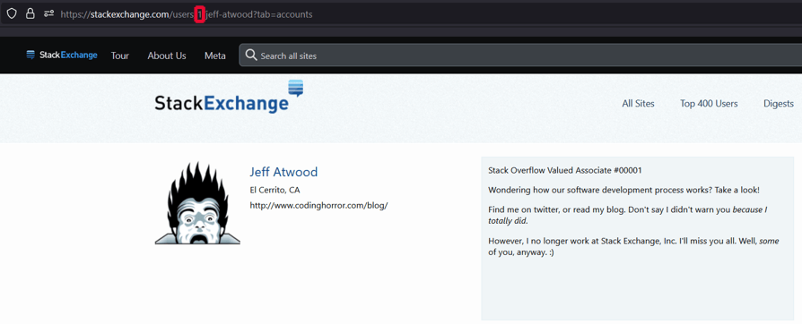

# Stack Exchange Backup

> [!CAUTION]
> Stack Exchange Backup is intended as a backup tool for your own personal writings on the Stack Exchange network sites 
> in the form of questions and answers.
> It is currently alpha software, so nothing is set in stone yet.
> If you publish the files created with this script, 
> you are fully responsible for the compliance with the terms of the content licenses, 
> as the attributions data may be incorrect or incomplete.
> Due to technical difficulties, some user contents may be missing from the backup.
> Please refer to the [omissions section](#omissions) for additional details.

> [!NOTE]
> This software is NOT an official product of, nor is it affiliated with, endorsed by, or sponsored by, 
> Stack Exchange, Inc.

## Showcase




## Installation

1. Either download the repository as a ZIP file and extract it,
   or [install Git](https://git-scm.com/downloads) (recommended) and do a `git clone` of the project.

   ```shell
   git clone https://github.com/9ao9ai9ar/stack-exchange-backup.git
   ```

2. [Install Python 3.12 or newer](https://www.python.org/downloads/).
   See the [support section](#support) for additional information.

3. Enter the directory you just extracted/cloned.

   ```shell
   cd stack-exchange-backup
   ```

   All steps hereafter assume operations under said directory.

4. Create and activate a virtual environment (strongly recommended).

    * Windows:

      ```shell
      py -3 -m venv .venv
      .\.venv\Scripts\activate
      ```

    * macOS/Linux:

       ```shell
       python3 -m venv .venv
       . .venv/bin/activate
       ```

5. Install `stack-exchange-backup` as a local Python package.

   ```shell
   python -m pip install .
   ```

   If the script fails to run due to changing dependencies, you may install the last known working versions.

   ```shell
   python -m pip install -r ./requirements.txt
   ```

## Usage

Remember to activate the virtual environment first!

```console
(.venv) $ python -m stackexchange.backup --help
usage: backup.py [-h] --account-id ACCOUNT_ID [--out-dir OUT_DIR] [--format {markdown,json}] [--no-meta]
                 [--clean] [--api-key API_KEY] [--limit-rate LIMIT_RATE]

options:
  -h, --help            show this help message and exit
  --account-id ACCOUNT_ID
                        user account ID on stackexchange.com
  --out-dir OUT_DIR     output directory (defaults to the current working directory)
  --format {markdown,json}
                        output file format (default: markdown)
  --no-meta             do not back up posts on meta sites
  --clean               remove files from the stack_user_id subdirectory before back up
  --api-key API_KEY     API key (for debugging only)
  --limit-rate LIMIT_RATE
                        maximum request rate in requests per second within the integer range of 1 and 30        
                        inclusive (default: 10)
```

* `ACCOUNT_ID`: the ID of the Stack Exchange network account whose posts you want to back up.
  Note that this is different from the per-site user IDs.
  To acquire the `ACCOUNT_ID` of a user:

    1. Go to the user's profile page on one of the Stack Exchange network sites
       and click on either the *View all* link next to *Communities*
       or the *Network profile* link in the dropdown under *Profiles*.

       

    2. On the new web page that is just opened, note the URL segment after `users` consists of a number:
       this is the `ACCOUNT_ID` of the user (1 in the case of Jeff Atwood).

       

* `OUT_DIR`: the folder to download your files to.

* `API_KEY`: a token that grants an increased query quota.
  A default API key is included and used automatically in the script.
  To access the API without using a key, assign an empty string as the value to this option.

* `LIMIT_RATE`: a soft limit imposed on the running program.
  It is [stated](https://api.stackexchange.com/docs/throttle) in no uncertain terms that
  the Stack Exchange API considers 30+ requests per second per IP to be very abusive,
  and will thus ban any rogue IP from making further requests to it for a period of time, typically within a few minutes.

## Output

### Directory Layout

The output directory layout is mostly a replication of the short form structures of 
the [Stack Exchange engine URLs](https://meta.stackexchange.com/q/332237) with minor differences.

```txt
stack_user_<ACCOUNT_ID>/
  <SITE_1_DOMAIN_NAME>/
    a/
      <NOT_MY_QUESTION_1_ID>/
        index.md
        <MY_ANSWER_1_ID>.md
        <OTHER_ANSWER_1_ID>.md
        ...
      ...
    q/
      <MY_QUESTION_1_ID>/
        index.md
        <ANSWER_1_ID>.md
        ...
      ...
  ...
```

### File Layout

The default Markdown output file layout contains a YAML front matter block, 
which is a way to add metadata to generated web pages in many static site generators.

```yaml
---
title: str # questions only
tags: # questions only
- str
view_count: int # questions only
is_accepted: bool # answers only
awarded_bounty_amount: int # answers only
score: int
up_vote_count: int
down_vote_count: int
owner:
  display_name: str
  user_type: str
  reputation: int
  link: str
creation_date: str
last_edit_date: str
community_owned_date: str
content_license: str
share_link: str
comments:
- score: int
  creation_date: str
  content_license: str
  link: str
  owner:
    display_name: str
    user_type: str
    reputation: int
    link: str
  body_markdown: str
---
{{ post.body_markdown }}
```

### Omissions

| Items                       | Reason                                                                                                                                                                                                                                                                                                                                                                                                                                                                                                                                       |
|-----------------------------|----------------------------------------------------------------------------------------------------------------------------------------------------------------------------------------------------------------------------------------------------------------------------------------------------------------------------------------------------------------------------------------------------------------------------------------------------------------------------------------------------------------------------------------------|
| Deleted posts               | [The API does not provide a way to retrieve deleted posts](https://stackapps.com/q/1917), even when authenticated.                                                                                                                                                                                                                                                                                                                                                                                                                           |
| (Some) community wiki posts | The API does not seem to provide an easy or reliable way to retrieve community wikis of which a user is a co-author but not the original poster. The authorships of community wikis are also difficult to programmatically determine and be given proper attributions. Additional reading: *[What are "Community Wiki" posts?](https://meta.stackexchange.com/q/11740)*                                                                                                                                                                      |
| (Some) migrated posts       | A migrated post can not be permanently linked back to the owner until they register for an account on the target site and associate it to their network profile. Additional reading: *[What is migration and how does it work?](https://meta.stackexchange.com/q/10249)*                                                                                                                                                                                                                                                                     |
| Answers to merged questions | In this rather rare occurrence, all of the merged question's answers become answers to the target question. Although the combined answers to the target question can be retrieved, it may be confusing to include them as they may quote from the target question and have an accepted status that the owner of the merged question might not agree with. Additional reading: *[What is a "merged" question?](https://meta.stackexchange.com/q/158066)*                                                                                      |
| Area 51 posts               | [Area 51 Discussions is not adequately supported in the API](https://stackapps.com/q/8726), and few people participated on this site.                                                                                                                                                                                                                                                                                                                                                                                                        |
| Articles                    | Being a part of collectives, articles have only been rolled out to Stack Overflow, and fewer than 200 articles have been [published](https://stackoverflow.com/collectives/articles) to date since its inception in 2021. Therefore, I have concluded it is not worth the effort to add support for backing up articles, despite them still being queryable through the [`/users/{ids}/posts`](https://api.stackexchange.com/docs/posts-on-users) endpoint after [`/articles` has been removed from the API](https://stackapps.com/q/10456). |
| Saves                       | When public favorites, also briefly known as bookmarks, got reworked into private saves, it was done without coordinated changes to the API, so [it became impossible to query a user's saves through the API](https://meta.stackexchange.com/q/382991).                                                                                                                                                                                                                                                                                     |

## Related Projects

### [Stack Exchange API](https://api.stackexchange.com/)

As one of the three official gateways to the public data on the Stack Exchange network,
the API is the most conducive to application development, but is also mired in bugs and limitations.
Therefore, it might be a good idea to cross-check or complement the API data with data obtained through other means.

#### [mhdadk/stack-exchange-backup](https://github.com/mhdadk/stack-exchange-backup)

The original repository from which this fork is derived.
I would like to express my thanks to its author, Mahmoud Abdelkhalek,
for his well-commented code expedited my process of grokking the Stack Exchange API, which,
while conceptually simple, has its documentation of related topics,
some insufficiently explained, and the numerous bugs scattered all over the place.

#### [StackExchangeBackupLaravel](https://github.com/ryancwalsh/StackExchangeBackupLaravelPHP)

StackExchangeBackupLaravel allows exporting a somewhat complete data footprint of a user on the Stack Exchange network.
The user contents are saved in JSON and uploaded to Amazon S3 by default.

### [Stack Exchange Data Explorer](https://data.stackexchange.com/)

The Stack Exchange Data Explorer (SEDE) is an open source tool
for running arbitrary queries against public data from the Stack Exchange network.
There are ready-made queries to export your data to a
[single HTML file](https://data.stackexchange.com/meta.stackexchange/query/758326)
or [CSV file](https://data.stackexchange.com/meta.stackexchange/query/1529864),
but the underlying data are only [refreshed weekly](https://data.stackexchange.com/help#faq),
as opposed to the data returned by the API, which are [refreshed about once a minute](https://stackapps.com/q/3543).

#### [Pippim Website](https://www.pippim.com/programs/stack.html)

A demo website that comes with a set of procedures and programs to help
convert your Stack Exchange posts into a fancy GitHub Pages website.

### [Stack Exchange Data Dump](https://stackoverflow.com/help/data-dumps)

The quarterly dump of all user-contributed data on the Stack Exchange network.
In an [announcement](https://meta.stackexchange.com/q/401324) made in July 2024,
the data dumps will no longer be [uploaded](https://archive.org/details/stackexchange) to the Internet Archive;
instead, they will be provided from a section in the site user profile settings.
Therefore, this method of backup has a few major downsides:

1. Being locked behind a login wall.
2. Being incomplete, meaning the data dump you download
   is only for the specific site from which you initiated the request.
3. Being complete, meaning the download size may be humongous, and to get only your data,
   you would have to do some non-trivial parsing of the downloaded XML files yourself.

#### [Stack Exchange data dump downloader and transformer](https://github.com/LunarWatcher/se-data-dump-transformer)

Thankfully, this project exists to address some of the above pain points.

## Development

### Process

My personal development process for this project is encoded in [`release.ps1`](./release.ps1),
a polyglot script that is valid in both the POSIX shell and PowerShell.
In addition to the dependencies specified in [`pyproject.toml`](./pyproject.toml), the script relies on the following utilities:

* [uv](https://github.com/astral-sh/uv)
* [security-constraints](https://github.com/mam-dev/security-constraints)
* [Pyright](https://github.com/microsoft/pyright)

which need to be installed and configured separately as instructed in the comments therein.

To help you in your experimentation with the Stack Exchange API through the documentation web pages,
I have compiled a list of the parameter types and their associated icons as follows:

*  Strings
* 
  [Numbers](https://api.stackexchange.com/docs/numbers)
* 
  [Dates](https://api.stackexchange.com/docs/dates)
* 
  [Lists](https://api.stackexchange.com/docs/vectors)
* 
  [Keys](https://api.stackexchange.com/docs/authentication)
* 
  [Access Tokens](https://api.stackexchange.com/docs/authentication)

Except for numbers and dates, the icons are not explained anywhere in the documentation,
but if you open the inspector in your web browser,
say when you are on [this page](https://api.stackexchange.com/docs/edit-question),
and check the `<input>` nodes enclosing the icons you are interested in learning about,
you will find that the parameter types are named in the `class` attributes, as `string-type`, `number-type`, etc.

### Roadmap

#### Alpha

* [ ] Provide a set of jq programs to: select for the data to keep in the backup, 
and reformat the metadata for better integrations with popular web publishing systems.
  * Thus redefining the Markdown split-file output as a series of post-processing steps to take 
  after obtaining the raw JSON output from the API.
* [ ] Add an option to save all images as files to combat hotlink protection and risk of link rot.

#### Beta

* [ ] Implement a resume-from-failure mechanism with a proper progress meter via `tqdm`.

#### Omega

* [ ] Migrate to Stack Exchange API v3.
* [ ] Add an option to retrieve all post revisions and turn them into patch files 
in some compatible mailbox format so they may readily be recorded in source control systems.

## Support

It is my policy to strive to support, within reason,
all [non-end-of-life, stable releases](https://devguide.python.org/versions/#status-key) of Python,
as well as all prominent, up-to-date Python implementations, namely CPython, PyPy and GraalPy.
If you are a Windows or macOS user, do note that official binaries are not provided for the security releases.
Thereby, I encourage you to instead install them from either the `defaults` (recommended) 
or the `conda-forge` conda channel, by using one of the 
[conda-compatible tools](https://conda.org/blog/2024-08-14-conda-ecosystem-explained/),
to benefit from the continuing security fixes.
